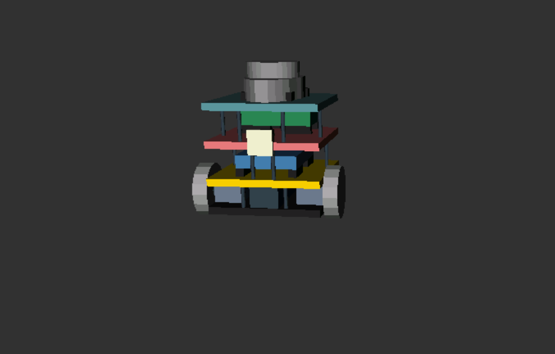
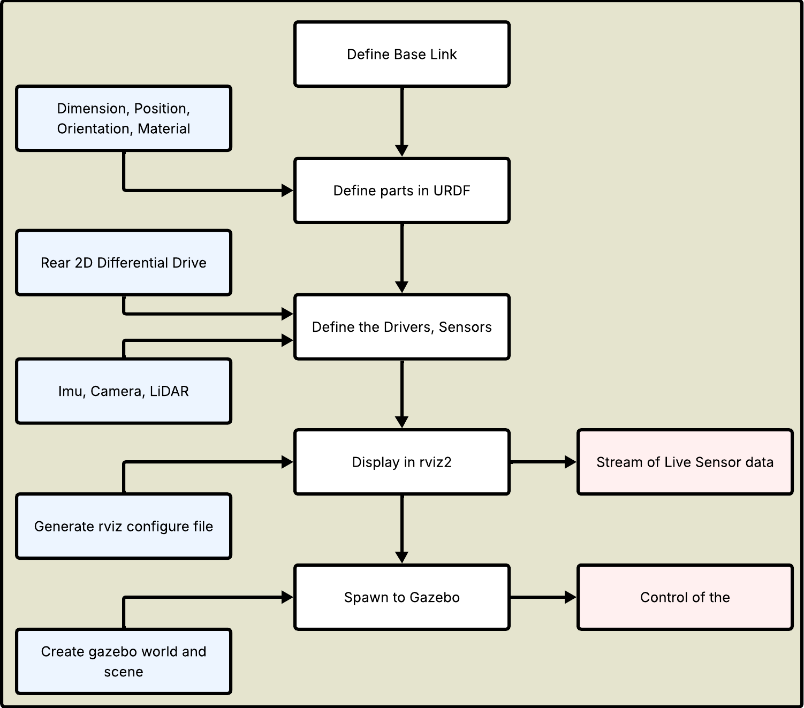
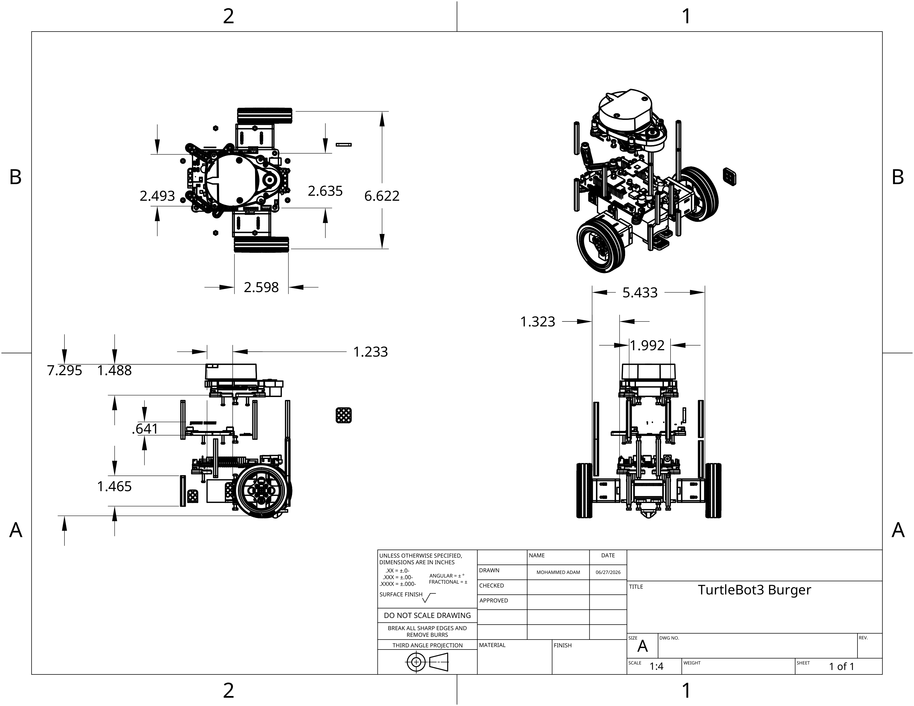
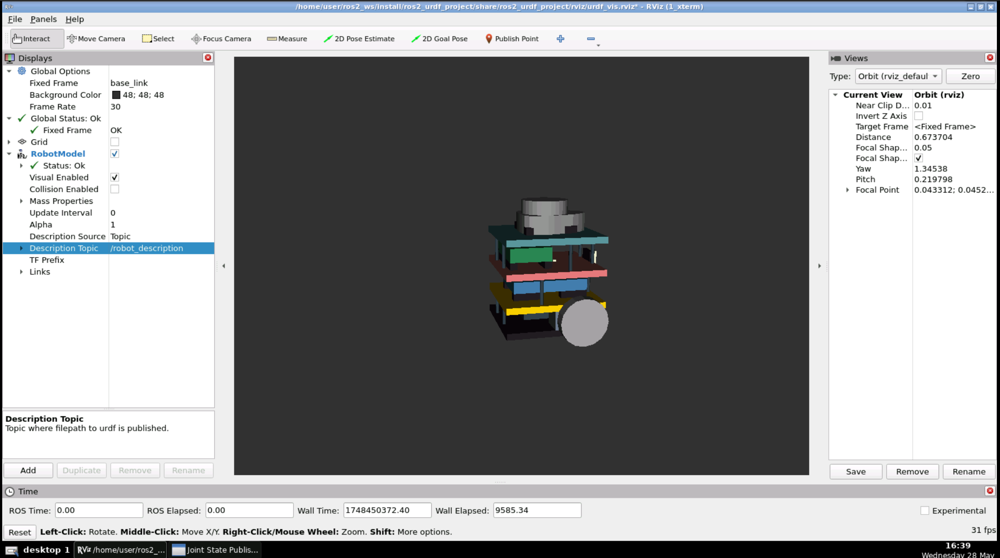
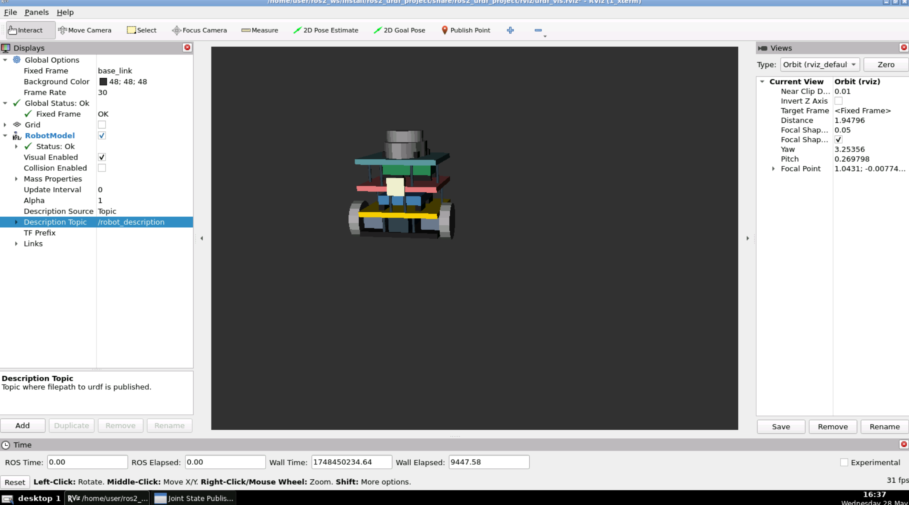
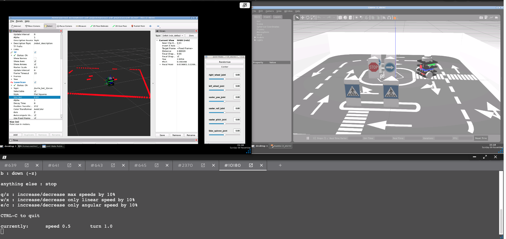
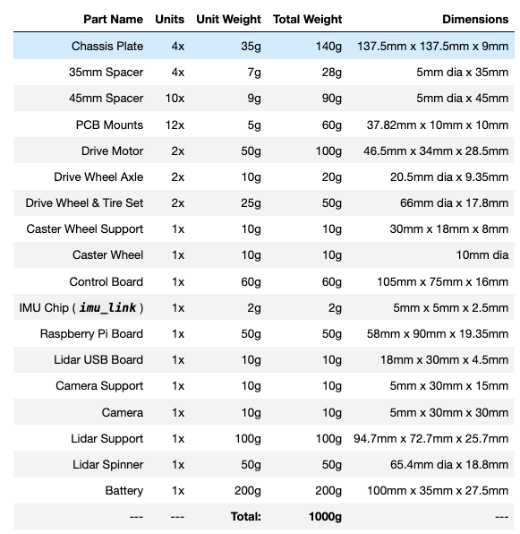

# MobileRobot3_Simulation

# Goal
The goal of this project is to simulate the robot Turtle3 that represent a ready to use setup to implement and test advance control and navigation programs and algorithms, the robot should: 
- Simulate TurtleBot3 and all its physical components. 
- Enable differntial drive of rear wheels 
- Stream live sensor data of an Imu and a Camera 
- Spawn the robot in a simulation environment in GAZEBO 

# 3D CAD Image of TurtleBot3

# Simulation phases

# Robot Dimensions

# Robot in RVIZ2
## Isometric view

## Front view

## Robot's Joints
https://github.com/user-attachments/assets/8f2fa331-0ee6-499d-a826-a313de59874f

# Robot in GAZEBO
## LiDAR publishes LaserScan message to rviz2

## The robot moves in Gazebo
https://github.com/user-attachments/assets/cb8e6ddd-4ad5-4fda-ba07-5f927e4eeb2a

# Bill of Materials

